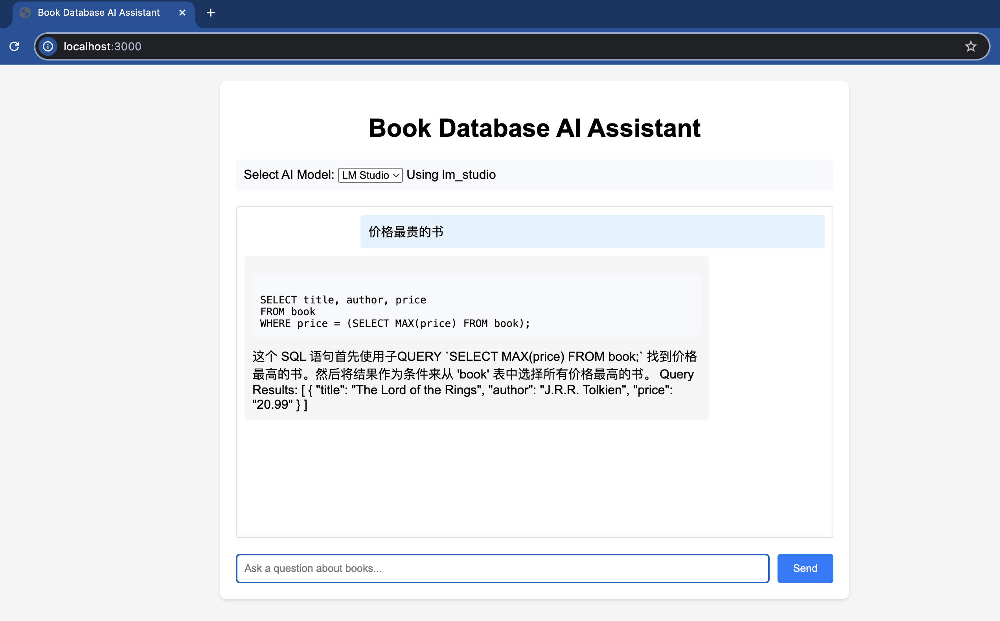

# MCP PostgreSQL Client

A PostgreSQL client implementation based on the Model Context Protocol.



## Prerequisites

1. Initialize PostgreSQL Database:
First, make sure you have PostgreSQL installed and running. Then create the sample database and table:

```sql
-- Create book table
CREATE TABLE book (
    id SERIAL PRIMARY KEY,         -- Auto-incrementing primary key
    title VARCHAR(255) NOT NULL,   -- Book title
    author VARCHAR(255) NOT NULL,  -- Author name
    published_date DATE,           -- Publication date
    genre VARCHAR(100),            -- Book genre
    price NUMERIC(10, 2)           -- Price
);

-- Insert sample data
INSERT INTO book (title, author, published_date, genre, price) VALUES
('The Great Gatsby', 'F. Scott Fitzgerald', '1925-04-10', 'Classic', 10.99),
('1984', 'George Orwell', '1949-06-08', 'Dystopian', 8.99),
('To Kill a Mockingbird', 'Harper Lee', '1960-07-11', 'Classic', 12.99),
('Pride and Prejudice', 'Jane Austen', '1813-01-28', 'Romance', 9.99),
('The Catcher in the Rye', 'J.D. Salinger', '1951-07-16', 'Classic', 10.49),
('The Hobbit', 'J.R.R. Tolkien', '1937-09-21', 'Fantasy', 14.99),
('Moby Dick', 'Herman Melville', '1851-10-18', 'Adventure', 11.99),
('War and Peace', 'Leo Tolstoy', '1869-01-01', 'Historical', 15.99),
('Crime and Punishment', 'Fyodor Dostoevsky', '1866-01-01', 'Crime', 13.49),
('The Alchemist', 'Paulo Coelho', '1988-01-01', 'Fiction', 9.49),
('The Lord of the Rings', 'J.R.R. Tolkien', '1954-07-29', 'Fantasy', 20.99),
('Harry Potter and the Sorcerer''s Stone', 'J.K. Rowling', '1997-06-26', 'Fantasy', 19.99),
('The Hunger Games', 'Suzanne Collins', '2008-09-14', 'Dystopian', 15.49),
('Brave New World', 'Aldous Huxley', '1932-01-01', 'Dystopian', 10.99),
('Jane Eyre', 'Charlotte Brontë', '1847-10-16', 'Romance', 8.99),
('Wuthering Heights', 'Emily Brontë', '1847-12-01', 'Romance', 9.49),
('Frankenstein', 'Mary Shelley', '1818-01-01', 'Horror', 7.99),
('Dracula', 'Bram Stoker', '1897-05-26', 'Horror', 6.99),
('The Odyssey', 'Homer', '800-01-01', 'Epic', 12.49),
('Don Quixote', 'Miguel de Cervantes', '1605-01-01', 'Adventure', 11.49);
```

2. Download MCP PostgreSQL Server:
```bash
git clone https://github.com/modelcontextprotocol/servers.git
cd servers
git checkout main
```

3. Build the PostgreSQL server:
```bash
cd src/postgres
npm install
npm run build
```
The build process will create `dist/index.js` which will be used as the server entry point.

4. Copy the PostgreSQL server implementation or update your environment variables to point to the built server:
```bash
# Option 1: Copy the server
cp -r src/postgres /path/to/your/project/server

# Option 2: Update POSTGRES_SERVER_PATH in .env
POSTGRES_SERVER_PATH=/path/to/servers/src/postgres/dist/index.js
```

## Project Description

This project provides a PostgreSQL client implementation using the Model Context Protocol, supporting database operations and web server functionality.

## Requirements

- Node.js (Latest LTS version recommended)
- PostgreSQL database
- npm or yarn package manager

## Installation

1. After cloning the project, navigate to the project directory:
```bash
cd clients
```

2. Install dependencies:
```bash
npm install
```

3. Configure environment variables:
   Create a `.env` file and set the following variables:
   ```
   DATABASE_URL=your_postgresql_database_url
   PORT=server_port_number (default 3000)
   ```

## Usage

### Build the project
```bash
npm run build
```

### Run in development mode
```bash
npm run dev
```

### Start the web server
```bash
npm run web
```

## Project Structure

- `src/`
  - `index.ts` - Main entry file
  - `server.ts` - Web server implementation
  - `PostgresClient.ts` - PostgreSQL client implementation

## Main Features

- PostgreSQL database operations
- Web API service
- Model Context Protocol integration

## Important Notes

1. Ensure environment variables are properly configured before running
2. Make sure PostgreSQL database service is running
3. Verify that required ports are not in use

## Tech Stack

- TypeScript
- Express.js
- PostgreSQL
- Model Context Protocol SDK
- dotenv
- OpenAI SDK
- Zod
